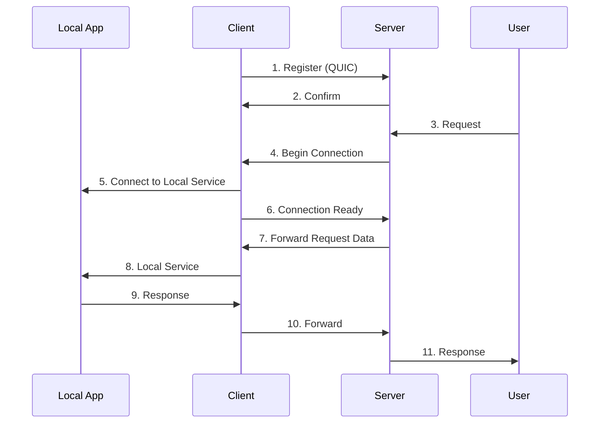

# Gunnel

A modern, lightweight, and secure tunneling solution written in Go.

[](https://goreportcard.com/report/github.com/snakeice/gunnel)
[](https://godoc.org/github.com/snakeice/gunnel)
[](LICENSE)

## Overview

Gunnel is a tunneling solution designed to securely expose your local services to the internet. It supports both HTTP and TCP protocols, offering features like connection pooling, automatic reconnection, and load balancing. Built on top of the QUIC (HTTP/3) protocol, it ensures modern security and high performance.

## Features

- Secure tunneling with QUIC (HTTP/3) protocol
- Automatic reconnection with exponential backoff
- Load balancing across multiple connections
- Support for both HTTP and TCP protocols
- High performance with minimal overhead
- Detailed logging using logrus
- Modern and user-friendly CLI interface
- Reliable connection handshake with ready state confirmation

## TODO

- Add support for Let's Encrypt certificates
- Remove insecure TLS configurations
- Handle connection timeouts, tunnel EOF, and other errors
- Implement a improved dashboard for monitoring connections and performance
- Add more detailed logging and metrics
- Add support for subdomain generation for dynamic tunnels

## Architecture



## Installation

```bash
go install github.com/snakeice/gunnel@latest
```

## Usage

### Server Mode

Start the server on a public machine:

```bash
gunnel server --port 8080
```

### Client Mode

Start the client on your local machine:

```bash
gunnel client \
  --host your-server.com \
  --port 8080 \
  --subdomain myapp \
  --local-port 3000 \
  --protocol http
```

### Configuration Options

#### Server Options

- `--port`: Port to listen on (default: 8080)

#### Client Options

- `--host`: Server host to connect to (default: localhost)
- `--port`: Server port to connect to (default: 8080)
- `--subdomain`: Subdomain for the tunnel (required)
- `--local-port`: Local port to proxy (required)
- `--protocol`: Protocol to use (http or tcp) (default: http)

## Examples

### Exposing a Local Web Server

```bash
# Start your local web server
python -m http.server 8000

# Start the tunnel client
gunnel client --subdomain myweb --local-port 8000
```

### Exposing a Local Database

```bash
# Start the tunnel client for MySQL
gunnel client --subdomain db --local-port 3306 --protocol tcp
```

## Development

### Prerequisites

- [Mise](https://github.com/jdx/mise) for task management and tool versioning
- Go 1.24 or later (automatically managed by Mise)

### Building

```bash
# Clone the repository
git clone https://github.com/snakeice/gunnel.git
cd gunnel

# Install dependencies and tools
mise run deps

# Build
mise run build

# Run tests
mise run test
```

### Available Tasks

- `mise run build`: Build the application
- `mise run test`: Run tests
- `mise run clean`: Clean build artifacts
- `mise run lint`: Run the linter
- `mise run deps`: Install dependencies
- `mise run run:server`: Run the server locally
- `mise run run:client`: Run the client locally
- `mise run air:server`: Run the server with Air
- `mise run air:client`: Run the client with Air

## Contributing

1. Fork the repository
2. Create your feature branch (`git checkout -b feature/amazing-feature`)
3. Commit your changes (`git commit -m 'Add some amazing feature'`)
4. Push to the branch (`git push origin feature/amazing-feature`)
5. Open a Pull Request

## License

This project is licensed under the MIT License - see the [LICENSE](LICENSE) file for details.

## Acknowledgments

- [logrus](https://github.com/sirupsen/logrus) for beautiful logging
- [cobra](https://github.com/spf13/cobra) for the CLI framework
- [mise](https://github.com/jdx/mise) for task management and tool versioning
- [quic-go](https://github.com/quic-go/quic-go) for QUIC protocol implementation
