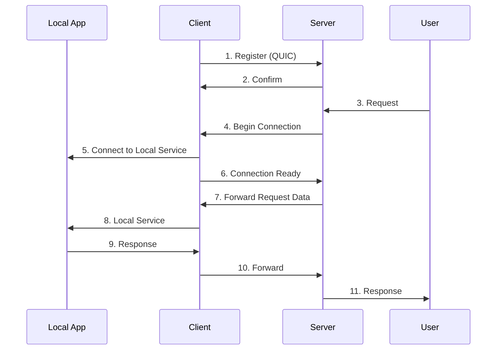

# Gunnel

A modern, lightweight, and secure tunneling solution written in Go.

[](https://github.com/snakeice/gunnel/actions/workflows/test.yml)
[](https://github.com/snakeice/gunnel/actions/workflows/release.yml)
[](https://goreportcard.com/report/github.com/snakeice/gunnel)
[](https://godoc.org/github.com/snakeice/gunnel)
[](LICENSE)
[](https://github.com/snakeice/gunnel/pkgs/container/gunnel)

## Overview

Gunnel is a tunneling solution designed to securely expose your local services to the internet. It supports both HTTP and TCP protocols, offering features like connection pooling, automatic reconnection, and load balancing. Built on top of the QUIC (HTTP/3) protocol, it ensures modern security and high performance.

## Features

- Secure tunneling with QUIC (HTTP/3) protocol
- Automatic reconnection with exponential backoff
- Load balancing across multiple connections
- Support for both HTTP and TCP protocols
- High performance with minimal overhead
- Detailed logging using logrus
- Modern and user-friendly CLI interface
- Reliable connection handshake with ready state confirmation

## TODO

- Remove insecure TLS configurations
- Implement a improved dashboard for monitoring connections and performance
- Add metrics
- Add support for subdomain generation for dynamic tunnels
- Support TCP tunneling with custom ports

## Architecture



## Installation

```bash
go install github.com/snakeice/gunnel@latest
```

## Usage

Gunnel can be run in either server or client mode and is configured using YAML configuration files.

### Docker

Docker images are available on GitHub Container Registry (ghcr.io). All images are built with Alpine Linux for minimal size (~20MB):

```bash
# Pull the latest image
docker pull ghcr.io/snakeice/gunnel:latest

# Run server with Docker
docker run -d \
  --name gunnel-server \
  -p 8081:8081 -p 80:80 -p 443:443 \
  -v $(pwd)/example/server.yaml:/etc/gunnel/server.yaml \
  ghcr.io/snakeice/gunnel:latest \
  server -c /etc/gunnel/server.yaml

# Run client with Docker
docker run -d \
  --name gunnel-client \
  -v $(pwd)/example/client.yaml:/etc/gunnel/client.yaml \
  ghcr.io/snakeice/gunnel:latest \
  client -c /etc/gunnel/client.yaml
```

For complex deployments, use the provided `docker-compose.example.yml`:

```bash
docker-compose -f docker-compose.example.yml up -d
```

### Server Mode

Start the server on a public machine:

```bash
# Using default configuration
gunnel server

# Using a custom configuration file
gunnel server -c ./example/server.yaml
```

### Client Mode

Start the client on your local machine:

```bash
# Using default configuration file (gunnel.yaml)
gunnel client

# Using a custom configuration file (with token)
export GUNNEL_TOKEN=YOUR_SHARED_TOKEN
gunnel client -c ./example/client.yaml
```

### Using Configuration Files

Gunnel uses YAML configuration files for both server and client modes. Example files are provided in the `example/` directory.

#### Server Configuration Example

```yaml
# example/server.yaml
domain: test.example.com
token: YOUR_SHARED_TOKEN
cert:
  enabled: true
  email: admin@example.com
```

#### Client Configuration Example

```yaml
# example/client.yaml
server:
  host: your-server.com
  port: 8080
tunnels:
  - subdomain: myapp
    local_port: 3000
    protocol: http
  - subdomain: db
    local_port: 3306
    protocol: tcp
```

### Command-Line Options

#### Global Options

- `--log-level`, `-l`: Set the logging level (trace, debug, info, warn, error, fatal, panic) (default: trace)

#### Server Options

- `--config`, `-c`: Path to the server configuration file

#### Client Options

- `--config`, `-c`: Path to the client configuration file (default: gunnel.yaml)

## Examples

### Exposing a Local Web Server

```bash
# Start your local web server
python -m http.server 8000

# Start the tunnel client
gunnel client --subdomain myweb --local-port 8000
```

### Exposing a Local Database

```bash
# Start the tunnel client for MySQL
gunnel client --subdomain db --local-port 3306 --protocol tcp
```

## Development

### Prerequisites

- [Mise](https://github.com/jdx/mise) for task management and tool versioning
- Go 1.24 or later (automatically managed by Mise)

### Building

```bash
# Clone the repository
git clone https://github.com/snakeice/gunnel.git
cd gunnel

# Install dependencies and tools
mise run deps

# Build
mise run build

# Run tests
mise run test
```

### Available Tasks

- `mise run build`: Build the application
- `mise run test`: Run tests
- `mise run clean`: Clean build artifacts
- `mise run lint`: Run the linter
- `mise run deps`: Install dependencies
- `mise run run:server`: Run the server locally
- `mise run run:client`: Run the client locally
- `mise run air:server`: Run the server with Air
- `mise run air:client`: Run the client with Air

## Contributing

1. Fork the repository
2. Create your feature branch (`git checkout -b feature/amazing-feature`)
3. Commit your changes (`git commit -m 'Add some amazing feature'`)
4. Push to the branch (`git push origin feature/amazing-feature`)
5. Open a Pull Request

## License

This project is licensed under the MIT License - see the [LICENSE](LICENSE) file for details.

## Acknowledgments

- [logrus](https://github.com/sirupsen/logrus) for beautiful logging
- [cobra](https://github.com/spf13/cobra) for the CLI framework
- [mise](https://github.com/jdx/mise) for task management and tool versioning
- [quic-go](https://github.com/quic-go/quic-go) for QUIC protocol implementation

## Quickstart

This quickstart uses the example configs and a simple local HTTP server included in this repo.

1) Install or build

```bash
go install github.com/snakeice/gunnel@latest
# or from source
git clone https://github.com/snakeice/gunnel.git
cd gunnel
go build ./...
```

2) Start a local app to expose (in a new terminal)

```bash
go run ./scripts/fake.go
```

3) Start the gunnel server (in another terminal)

```bash
# from repo root
go run . server -c ./example/server.yaml
# or if you installed the binary
gunnel server -c ./example/server.yaml
```

4) Start the gunnel client (in another terminal)

```bash
# from repo root
go run . client -c ./example/client.yaml
# or if you installed the binary
gunnel client -c ./example/client.yaml
```

5) Test the tunnel

```bash
# If your system resolves *.localhost, this works:
curl http://test.localhost:8080/
# Otherwise, add this to /etc/hosts:
# 127.0.0.1 test.localhost
# and then:
curl -H "Host: test.localhost" http://127.0.0.1:8080/
```

You should see the JSON response from the example app running on port 3000.

## Configuration Reference

Gunnel uses YAML configuration files. This repo includes ready-to-use examples under example/.

- Server configuration (example/server.yaml as provided in the repo):

```yaml
# example/server.yaml
domain: test.example.com
tls:
  enable: true
  email: admin@example.com
  production: false  # Set to true for production Let's Encrypt certificates
  # The following fields are only needed if you're configuring a custom backend
  # host: localhost
  # port: 3000
```

Notes:
- The server listens for HTTP users on server_port (default 8080) and for QUIC clients on quic_port (default 8081).
- For TLS via Let's Encrypt, the current server supports a cert section in config (preferred):
  - cert.enabled: true|false
  - cert.email: your-email
  If you use the provided example (tls block), the server will still start but TLS will only be enabled when cert.enabled is set under cert.

- Client configuration (example/client.yaml as provided in the repo):

```yaml
server_addr: localhost:8081
backend:
  test: 
    port: 3000
    subdomain: test
    protocol: http
  svc: 
    host:
    port: 3000
    subdomain: svc
    protocol: http
```

Client config fields:
- server_addr: host:port of the server QUIC endpoint (default on server is :8081)
- backend: a map of named backends
  - host: defaults to localhost
  - port: required (e.g., 3000)
  - subdomain: required (e.g., test → test.<domain>)
  - protocol: http or tcp (defaults to http)

## Testing

- Unit tests

```bash
go test ./...
```

- Lint (if you use mise)

```bash
mise run lint
```

- End-to-end (local)

Option A: Manual (as in Quickstart)
1) go run ./scripts/fake.go
2) go run . server -c ./example/server.yaml
3) go run . client -c ./example/client.yaml
4) curl -H "Host: test.localhost" http://127.0.0.1:8080/

Option B: Dev workflow with hot-reload (requires tmux, mise, and air configured)
```bash
bash ./scripts/debug-watch.sh
```

This launches:
- a fake local server (scripts/fake.go)
- the gunnel server with Air reloader
- the gunnel client with Air reloader
- a periodic curl to test.localhost:8080

## Examples using provided configs

- Expose a local web server on subdomain test:

```bash
# local app
go run ./scripts/fake.go

# server (on a public or local machine)
gunnel server -c ./example/server.yaml

# client (on your machine running the app)
gunnel client -c ./example/client.yaml

# test
curl -H "Host: test.localhost" http://127.0.0.1:8080/
```

- Expose another service (svc) on port 3000:

Add under backend in example/client.yaml:
```yaml
svc:
  host: localhost
  port: 3000
  subdomain: svc
  protocol: http
```

Then:
```bash
gunnel client -c ./example/client.yaml
curl -H "Host: svc.localhost" http://127.0.0.1:8080/
```

Tip: The web dashboard is served at the special subdomain gunnel (used internally) to expose basic stats and health.
